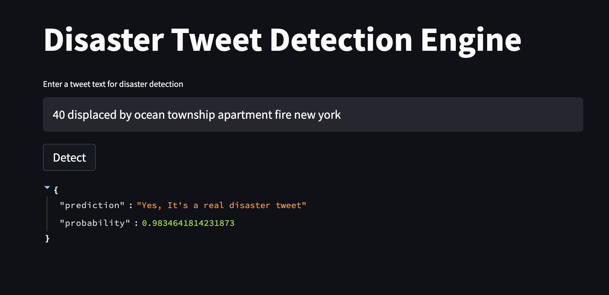

# Real Disaster Tweet Detection

This is a project which builds an AI model to detect disaster twitter. The data is from 
from [Kaggle disaster twitter](https://www.kaggle.com/c/nlp-getting-started). 
The training framework is based on huggingface transformers 
while streamlit is used for web UI app. 

## Contributors and distributions
Team 4
- Jiameng Sun: 
  - Cleaned 2015 Data
  - Fine-tuned BERT Model
  - Data exploration
    
- Yanwen Duan: 
  - Clean 2020 Data
  - Fine-tuned BERTweet Model  
  - Built web app 
 

## Environment Setup
please use python 3.7+.
```bash
pip install -r requirements.txt
```

## Data Preprocessing
This would combine 2020 and 2015 training data, then clean up and 
generate the final training and test data.
```bash
cd src
python3 prepare_training_data.py
```
## Model Training
Recommend using Google Colab GPU environment.
The training script is adapted and modified from huggingface 
[run_glue.py](https://github.com/huggingface/transformers/blob/master/examples/pytorch/text-classification/run_glue.py)

We also added parameters `freeze_bert_layers` and `freeze_twitter_bert_layers` to freeze encoder layers 
and only fine tune the top head layer.
```jupyterpython
# recommend initializing a wandb to monitor GPU system metrics and model performance
import wandb
wandb.init()
```
Then run the following training command.
```bash
# bert: fine tune pretrained bert layers and fine tune head classification layer 
python3 run_twitter_classification.py \
  --model_name_or_path bert-base-uncased \
  --train_file ./joined_train.csv  \
  --validation_file ./joined_test.csv \
  --do_train \
  --do_eval \
  --max_seq_length 128 \
  --per_device_train_batch_size 64 \
  --per_device_eval_batch_size 64 \
  --learning_rate 2e-5 \
  --num_train_epochs 3 \
  --output_dir ./model/ \
  --evaluation_strategy epoch \
  --dataloader_drop_last \
  --overwrite_output_dir \
  --logging_steps 5 \
  --pad_to_max_length False
  
# twitter bert: fine tune pretrained bert layers and fine tune head classification layer 
python3 run_twitter_classification.py \
  --model_name_or_path vinai/bertweet-base \
  --train_file ./joined_train.csv  \
  --validation_file ./joined_test.csv \
  --do_train \
  --do_eval \
  --max_seq_length 128 \
  --per_device_train_batch_size 64 \
  --per_device_eval_batch_size 64 \
  --learning_rate 2e-5 \
  --num_train_epochs 3 \
  --output_dir ./model/ \
  --evaluation_strategy epoch \
  --dataloader_drop_last \
  --overwrite_output_dir \
  --logging_steps 5 \
  --pad_to_max_length False  
```

## Demo App
Download the model to `model/` folder. Then the following script can set up 
a web UI for demo. 
Users can type the twitter and click the `Detect` button to 
check whether it is a real disaster.
```shell
streamlit run twitterbert_app.py
```
